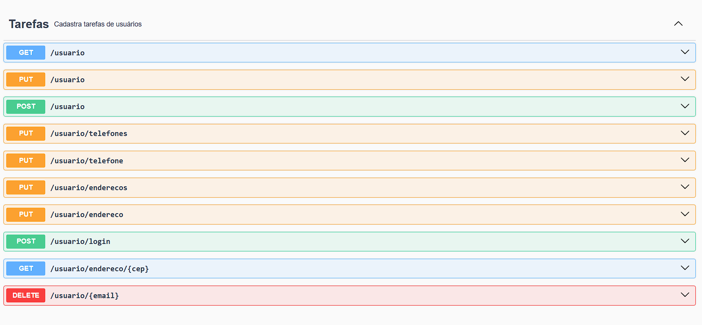

# 📌 API de Usuários – Spring Boot + JWT + ViaCEP

API REST desenvolvida em **Java 21 com Spring Boot 3**, responsável pelo **gerenciamento de usuários**, incluindo autenticação via **JWT**, cadastro e atualização de **endereços e telefones**, além de **integração externa com a API ViaCEP** para validação de endereços.

O projeto segue boas práticas de **arquitetura em camadas**, **segurança stateless** e **documentação OpenAPI (Swagger)**.




------------------------------------------------------------------------------------------------------------------------

## 🛠️ Tecnologias Utilizadas

- Java 21
- Spring Boot 3.2
- Spring Web
- Spring Data JPA
- Spring Security
- JWT (JSON Web Token)
- OpenFeign
- PostgreSQL
- Hibernate
- Swagger / OpenAPI (SpringDoc)
- Lombok
- Maven / Gradle

------------------------------------------------------------------------------------------------------------------------


## 🧱 Arquitetura do Projeto

```text
controller
 └── UsuarioController

busines
 ├── UsuarioService
 └── ViaCepService

infraestruture
 ├── client
 │    └── ViaCepClient
 │
 └── security
      ├── SecurityConfig
      ├── JwtUtil
      └── JwtRequestFilter

dto
 ├── UsuarioDTO
 ├── EnderecoDTO
 └── TelefoneDTO

repository
 ├── UsuarioRepository
 ├── EnderecoRepository
 └── TelefoneRepository
 ------------------------------------------------------------------------------------------------------------------------


🔐 Segurança

Autenticação baseada em JWT

API stateless (SessionCreationPolicy.STATELESS)

Endpoints públicos:

Cadastro de usuário

Login

Consulta de endereço via CEP

Demais endpoints exigem Bearer Token
------------------------------------------------------------------------------------------------------------------------


📄 Documentação da API (Swagger)

A documentação está disponível em:

http://localhost:8080/swagger-ui.html
------------------------------------------------------------------------------------------------------------------------


🔑 Fluxo de Autenticação

Cadastro de usuário

Login

Retorna token JWT

Enviar o token no header:

Authorization: Bearer <token>


protegidos
------------------------------------------------------------------------------------------------------------------------


📌 Endpoints Principais
Públicos

POST /usuario – Cadastro de usuário

POST /usuario/login – Autenticação

GET /usuario/endereco/{cep} – Consulta ViaCEP

Protegidos (JWT)

GET /usuario

PUT /usuario

PUT /usuario/enderecos

PUT /usuario/endereco

PUT /usuario/telefones

PUT /usuario/telefone

DELETE /usuario/{email}

------------------------------------------------------------------------------------------------------------------------

✅ Status do Projeto

✔ Funcional
✔ Segurança implementada
✔ Documentação Swagger
✔ Integração externa (ViaCEP)
✔ Pronto para evolução e deploy


------------------------------------------------------------------------------------------------------------------------


👤 Autor

Jhonatan Teles de Oliviera
Projeto desenvolvido para fins de estudo, prática profissional e portfólio backend Java.
------------------------------------------------------------------------------------------------------------------------

